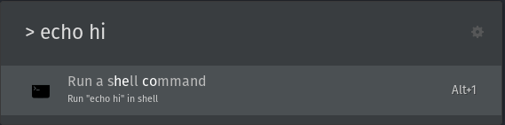
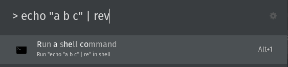
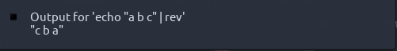

# Terminal Runner

Simple terminal runner extension for [ULauncher](https://ulauncher.io/).

Currently exists just for me so caveat emptor.

(Original from [henriqueutsch](https://github.com/henriqueutsch/exec-terminal))

## Features

- Output/error notifications (can be disabled)  

  

- Handles pipes (only simple test cases tried so far, any failures feel free to subit a PR!)

  

